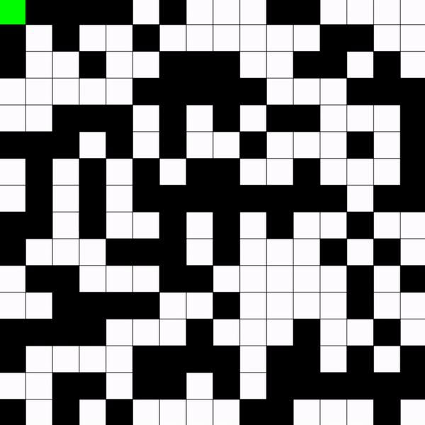
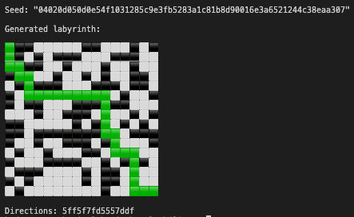

# Labyrinth

Envision a 16x16 grid, a sophisticated maze that beckons you to embark on a journey from the top left block (index 0) to the bottom right block (index 0xFF). The structure of this labyrinth, its intricate network of meandering paths and unyielding walls, springs from a uint256 _start parameter, a cryptic sequence of 256-bit values.

The generation of this labyrinth is a meticulous process. Starting from the least significant bit, each bit of the _start parameter is read. If a bit is 0, the corresponding square in the grid is marked as a path, inviting passage. Conversely, if a bit is 1, the corresponding square transforms into a wall, an impenetrable barrier. This pattern continues, each bit shaping the grid, until the _start parameter has been fully interpreted. The result is a unique labyrinth, its layout an embodiment of the _start cryptogram.

Journeying through this labyrinth is a quest in itself, granting the options to move up, down, left, or right. Each direction is but a 2-byte value, a humble command that guides your path:

b00: Up
b01: Right
b10: Left
b11: Down

Now, behold the labyrinth's enigmatic paradox: frequently, there exists no path to victory. The `_start` seed, the hidden hand shaping the labyrinth's reality, is tied to the block number, undergoing metamorphosis with each emerging block. The gauntlet is thus thrown: to patiently seek and await the arrival of a block that harbors a valid solution.

In crafting this labyrinth, my intent was twofold. Firstly, I sought to introduce a unique twist to the narrative of the puzzle—-the impermanent nature of the solution added a touch of the sands of time. Secondly, I endeavored to infuse thematic elements, inspired by the rich mythology of labyrinths, to weave a captivating narrative around the puzzle.

Recognizing the labyrinth's demanding complexity, I saw fit to interweave subtle hints throughout. Although they won't unveil the mystery outright, they may lend a guiding hand, becoming clear as day once the puzzle is solved. In an ode to the labyrinth itself, the fundamental logic of the puzzle mirrors its pattern and even presents a path to a solution.

This, fellow seekers, is the labyrinth—-a digital enigma, a philosophical meditation, a cryptic journey through complexity and creativity. And as we voyage through it, may we remember: the journey is the destination.

### Creation Process

The concept in mind, the first task was to assure the feasibility of locating a solvable block within a reasonable frame of time. To achieve this, I crafted a [simple script](./rust/src/probability.rs). This program constructed labyrinths, governed by a pseudo-random number generator, and endeavored to solve them using a straightforward depth-first search. This process was reiterated a million times, each instance an investigation into the number of solvable cases, with the aim of determining the probability.

With this assurance that it was within the realm of possibility, I embarked on the journey of crafting a [simple contract implementation](./src/Labyrinth.sol). Progressing further, I [refashioned it in Huff](https://github.com/kadenzipfel/labyrinth/blob/1965c2c9d37838be4066fc38e9401cfb46a81723/src/Labyrinth.huff), then delved into the process of obscuring the [final contract](./src/Labyrinth.huff). Along this path, I wove in artistic elements and subtle hints, each inclusion a testament to the labyrinth's intricate design.

### Solution

The task of deciphering this labyrinth puzzle unfurls in a series of deliberate steps: deobfuscation, comprehending the intrinsic logic, the search for a solution, and the act of submission.

The first endeavor is to unravel the obscurity—-this may be done by manual disassembly or by navigating through a debugger, attentively tracing the execution flow and stripping away superfluous jump logic. Some seekers chose to harness the power of scripts to streamline this process. Among these, [Philogy's script](https://gist.github.com/Philogy/21baf056c80db51b2b6217c563b4cd64#file-declutter-verify-py) proved particularly insightful.

To triumph over the labyrinth, one must delve into the heart of its logic, a fundamental understanding of the start and end points, the navigation mechanisms, and a visual interpretation of its machinations.

A pivotal revelation in this journey is that often, there is no path to victory. This necessitates the crafting of a [script](./rust/src/solve.rs), a digital oracle designed to predict the arrival of the next solvable block.

The final step in this saga is submission—-a strategic play that requires one to anticipate the n-1 block and initiate with a favorable priority fee. Some challengers endeavored to employ flashbots protect, yet this strategy, though well-intentioned, seemed more an obstacle than a means to the end.

### Conclusion

In its final form, this puzzle transformed into something beyond a mere challenge—-it became a work of art. This project offered a riveting journey to the crossroads of logic and creativity, delicately obscuring the boundaries between the two. I hope that this endeavor might kindle a spark in others, inspiring them to embark on similar adventures. As for me, I eagerly await the prospect of weaving more such enchanting tapestries of art and technology in the future.