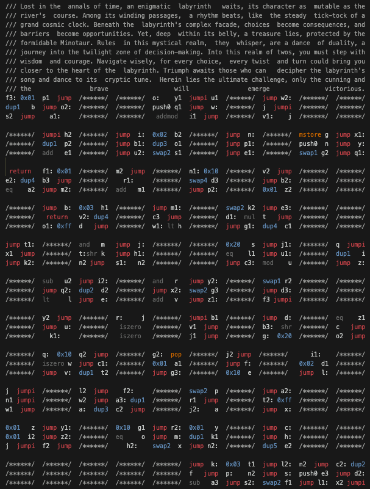

# Labyrinth

Envision a 16x16 grid, a sophisticated maze that beckons you to embark on a journey from the top left block (index 0) to the bottom right block (index 0xFF). The structure of this labyrinth, its intricate network of meandering paths and unyielding walls, springs from a uint256 `_start` parameter, a cryptic sequence of 256-bit values.

The generation of this labyrinth is a meticulous process. Starting from the least significant bit, each bit of the `_start` parameter is read. If a bit is 0, the corresponding square in the grid is marked as a path, inviting passage. Conversely, if a bit is 1, the corresponding square transforms into a wall, an impenetrable barrier. This pattern continues, each bit shaping the grid, until the `_start` parameter has been fully interpreted. The result is a unique labyrinth, its layout an embodiment of the `_start` cryptogram.

Journeying through this labyrinth is a quest in itself, granting the options to move up, down, left, or right. Each direction is but a 2-byte value, a humble command that guides your path:

```
b00: Up
b01: Right
b10: Left
b11: Down
```

Regrettably, both the mechanisms for moving left and upward carry within them flaws that hinder their intended functions. However, fortune smiles upon us as our primary course requires us to journey primarily downwards and towards the right.

Now, behold the labyrinth's enigmatic paradox: frequently, there exists no path to victory. The `_start` seed, the hidden hand shaping the labyrinth's reality, is tied to the block number, undergoing metamorphosis with each emerging block. The gauntlet is thus thrown: to patiently seek and await the arrival of a block that harbors a valid solution.

In crafting this labyrinth, my intent was twofold. Firstly, I sought to introduce a unique twist to the narrative of the puzzle—-the impermanent nature of the solution added a touch of the sands of time. Secondly, I endeavored to infuse thematic elements, inspired by the rich mythology of labyrinths, to weave a captivating narrative around the puzzle.

Recognizing the labyrinth's demanding complexity, I saw fit to interweave subtle hints throughout. Although they won't unveil the mystery outright, they may lend a guiding hand, becoming clear as day once the puzzle is solved. In an ode to the labyrinth itself, the fundamental logic of the puzzle mirrors its pattern and even presents a path to a solution.

This, fellow seekers, is the labyrinth—-a digital enigma, a philosophical meditation, a cryptic journey through complexity and creativity. And as we voyage through it, may we remember: the journey is the destination.

### Creation Process

I started off by wanting to make sure it was even possible to find a solution within a reasonable timeframe. To do this, I created a [simple script](./rust/src/probability.rs). This script builds labyrinths using a pseudo-random number generator and then tries to solve them with a simple depth-first search. I ran this a million times, checking how many labyrinths were solvable, to estimate the chances of finding a solution.

Once I confirmed this was doable, I started writing a [simple contract implementation](./src/Labyrinth.sol). After that, I [rewrote it in Huff]((https://github.com/kadenzipfel/labyrinth/blob/1965c2c9d37838be4066fc38e9401cfb46a81723/src/Labyrinth.huff)), and then worked on obfuscating the [final contract](./src/Labyrinth.huff) to make it harder to understand, while also arranging it in the shape of the puzzle itself. Throughout this process, I added artistic elements and small hints that reflected the intricate design of the labyrinth while creating an atmospheric mythological context.



### Solution

Solving this labyrinth puzzle involves a few steps: unscrambling the contract, understanding how it works, finding a solution, and then timing the submission of the solution.

You can unscramble the contract manually or by using a debugger, tracing how it executes and removing any unnecessary steps. Some people made scripts to make this easier. Among these, [Philogy's script](https://gist.github.com/Philogy/21baf056c80db51b2b6217c563b4cd64#file-declutter-verify-py) seemed really useful.

To beat the labyrinth, you need to understand how it works: where it starts and ends, how it navigates, and [how its logic works visually](https://editor.p5js.org/KadenZipfel/full/CCG0L_uWu).


Often, there's no solution. In those cases, you need to write a [script](./rust/src/solve.rs) that can predict when the next solvable block will appear.


Finally, to submit your solution, you need to wait for the n-1 block and submit it with a high priority fee. Some people tried to use flashbots protect, but unfortunately that seemed to be more of a hindrance.

### Conclusion

In the end, this puzzle became more than just a challenge - it turned into a piece of art. It was a fun way to explore the intersection of logic and creativity, and I hope it inspires others to take on similar projects. As for me, I can't wait to create more projects that blend art and technology in the future.